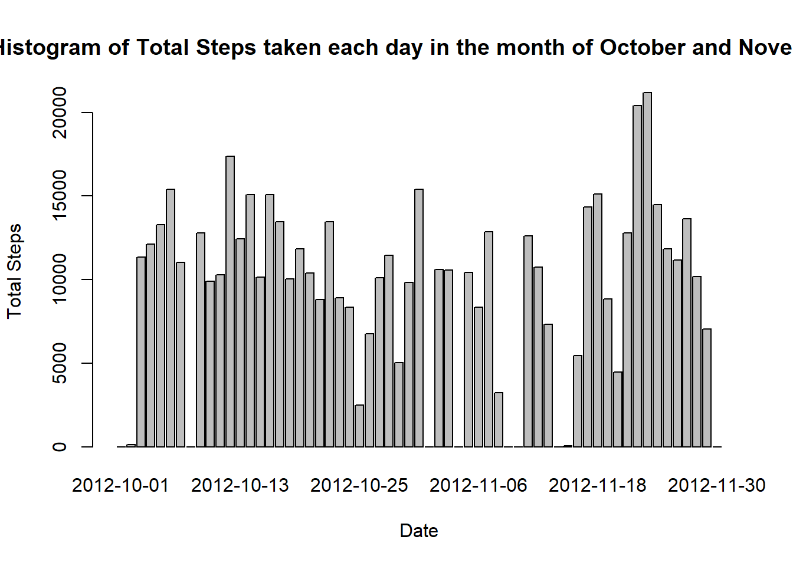
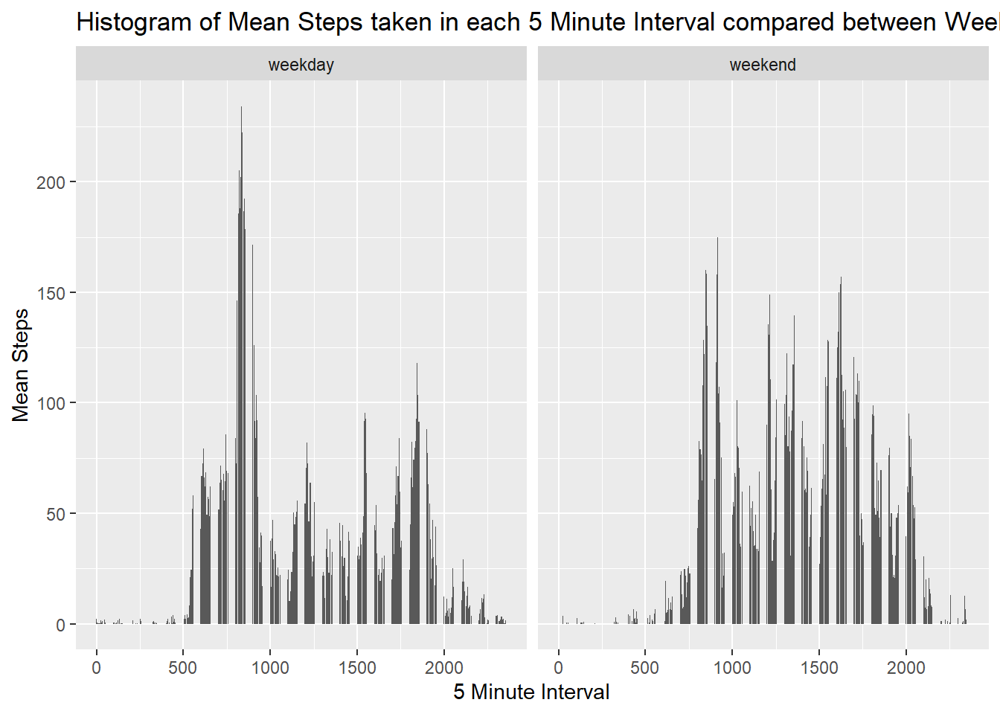

#Loading the raw data file into R and installing the required packages


```r
activity_monitoring_data <- read.csv("activity.csv", header=TRUE)
install.packages("dplyr", repos = "http://cran.us.r-project.org", dependencies = TRUE)
```

```
## Installing package into 'C:/Users/ssakub/Documents/R/win-library/3.4'
## (as 'lib' is unspecified)
```

```
## Warning in install.packages :
##   dependency 'Lahman' is not available
```

```
## also installing the dependencies 'ellipsis', 'blob', 'glue', 'lifecycle', 'rlang', 'tibble', 'tidyselect', 'vctrs', 'dbplyr'
```

```
## 
##   There are binary versions available but the source versions are later:
##             binary source needs_compilation
## ellipsis     0.1.0  0.3.1              TRUE
## blob         1.1.1  1.2.1             FALSE
## glue         1.3.1  1.4.1              TRUE
## rlang        0.3.4  0.4.6              TRUE
## tibble       2.1.1  3.0.1              TRUE
## tidyselect   0.2.5  1.1.0              TRUE
## vctrs        0.1.0  0.3.1              TRUE
## dbplyr       1.4.0  1.4.4             FALSE
## dplyr      0.8.0.1  1.0.0              TRUE
```

```
## Do you want to install from sources the packages which need compilation?
```

```
## package 'ellipsis' successfully unpacked and MD5 sums checked
## package 'glue' successfully unpacked and MD5 sums checked
## package 'rlang' successfully unpacked and MD5 sums checked
## package 'tibble' successfully unpacked and MD5 sums checked
## package 'tidyselect' successfully unpacked and MD5 sums checked
## package 'vctrs' successfully unpacked and MD5 sums checked
## package 'dplyr' successfully unpacked and MD5 sums checked
## 
## The downloaded binary packages are in
## 	C:\Users\ssakub\AppData\Local\Temp\RtmpAFzh7g\downloaded_packages
```

```
## installing the source packages 'blob', 'lifecycle', 'dbplyr'
```

```
## Warning in install.packages :
##   running command '"C:/PROGRA~1/R/R-34~1.2/bin/x64/R" CMD INSTALL -l "C:\Users\ssakub\Documents\R\win-library\3.4" C:\Users\ssakub\AppData\Local\Temp\RtmpAFzh7g/downloaded_packages/blob_1.2.1.tar.gz' had status 1
## Warning in install.packages :
##   installation of package 'blob' had non-zero exit status
## Warning in install.packages :
##   running command '"C:/PROGRA~1/R/R-34~1.2/bin/x64/R" CMD INSTALL -l "C:\Users\ssakub\Documents\R\win-library\3.4" C:\Users\ssakub\AppData\Local\Temp\RtmpAFzh7g/downloaded_packages/lifecycle_0.2.0.tar.gz' had status 1
## Warning in install.packages :
##   installation of package 'lifecycle' had non-zero exit status
## Warning in install.packages :
##   running command '"C:/PROGRA~1/R/R-34~1.2/bin/x64/R" CMD INSTALL -l "C:\Users\ssakub\Documents\R\win-library\3.4" C:\Users\ssakub\AppData\Local\Temp\RtmpAFzh7g/downloaded_packages/dbplyr_1.4.4.tar.gz' had status 1
## Warning in install.packages :
##   installation of package 'dbplyr' had non-zero exit status
```

```r
install.packages("timeDate", repos = "http://cran.us.r-project.org", dependencies = TRUE)
```

```
## Installing package into 'C:/Users/ssakub/Documents/R/win-library/3.4'
## (as 'lib' is unspecified)
```

```
## package 'timeDate' successfully unpacked and MD5 sums checked
## 
## The downloaded binary packages are in
## 	C:\Users\ssakub\AppData\Local\Temp\RtmpAFzh7g\downloaded_packages
```

```r
install.packages("reshape2", repos = "http://cran.us.r-project.org", dependencies = TRUE)
```

```
## Installing package into 'C:/Users/ssakub/Documents/R/win-library/3.4'
## (as 'lib' is unspecified)
```

```
## 
##   There is a binary version available but the source version is later:
##          binary source needs_compilation
## reshape2  1.4.3  1.4.4              TRUE
```

```
## Do you want to install from sources the package which needs compilation?
```

```
## package 'reshape2' successfully unpacked and MD5 sums checked
## 
## The downloaded binary packages are in
## 	C:\Users\ssakub\AppData\Local\Temp\RtmpAFzh7g\downloaded_packages
```

```r
install.packages("ggplot2", repos = "http://cran.us.r-project.org", dependencies = TRUE)
```

```
## Installing package into 'C:/Users/ssakub/Documents/R/win-library/3.4'
## (as 'lib' is unspecified)
```

```
## 
##   There is a binary version available but the source version is later:
##         binary source needs_compilation
## ggplot2  3.1.1  3.3.2             FALSE
```

```
## installing the source package 'ggplot2'
```

```r
library(timeDate)
```

```
## Warning: package 'timeDate' was built under R version 3.4.4
```

```r
library(reshape2)
```

```
## Warning: package 'reshape2' was built under R version 3.4.4
```

```r
library(ggplot2)
library(dplyr)
```

```
## Warning: package 'dplyr' was built under R version 3.4.4
```

```
## 
## Attaching package: 'dplyr'
```

```
## The following objects are masked from 'package:stats':
## 
##     filter, lag
```

```
## The following objects are masked from 'package:base':
## 
##     intersect, setdiff, setequal, union
```

#Plotting the Histogram of the total number of steps taken each day


```r
#Calculate total steps per day and convert into a dataframe
total_steps <-with(activity_monitoring_data, tapply(steps,date,sum, na.rm=TRUE))
total_steps_df <-melt(total_steps, varnames = "date", value.name = "total_steps")
rm(total_steps)
with(total_steps_df, barplot(total_steps, names.arg=date, xlab="Date", ylab="Total Steps", main="Histogram of Total Steps taken each day in the month of October and November"))
```



#Calculating mean and median number of steps taken each day


```r
summary_data <- activity_monitoring_data %>% group_by(date) %>% summarise(mean_steps=mean(steps,na.rm=TRUE),
                                                                          median_steps=median(steps[steps>0], na.rm=TRUE))

par(mfrow=c(1,2))

#Plotting the Histogram of Mean and Median steps for each day in October and November

with(summary_data, barplot(mean_steps, names.arg=date, xlab="Date", ylab="Mean Steps", main="Histogram of Mean steps each day"))

with(summary_data, barplot(median_steps, names.arg=date, xlab="Date", ylab="Median Steps", main="Histogram of Median steps each day"))
```


#Plotting a time series plot using the Summary data from Chunk3 for mean steps

```r
ggplot(summary_data, aes(as.Date(date), mean_steps)) + geom_line(na.rm=TRUE)
```


#Calculate the 5 minute interval with maximum average number of steps

```r
summary_data <- activity_monitoring_data %>% group_by(interval) %>% summarise(mean_steps=mean(steps,na.rm=TRUE)) %>% arrange(-mean_steps) %>% slice(n=1)
interval<- summary_data$interval
mean_steps <- summary_data$mean_steps
## Interval 835 has maximum mean steps = 206
```

# Imputation for missing values

```r
#Replace the missing value for steps column by average value for each interval to include the impact of each interval on the
#number of steps taken

activity_monitoring_data <- activity_monitoring_data %>% group_by(interval) %>% mutate(steps_impute =ifelse(is.na(steps),mean(steps, na.rm=TRUE), steps))
```

# Histogram of total steps each day using new imputed steps column in Chunk6

```r
total_steps <-with(activity_monitoring_data, tapply(steps_impute,date,sum, na.rm=TRUE))
total_steps_df <-melt(total_steps, varnames = "date", value.name = "total_steps")
rm(total_steps)
with(total_steps_df, barplot(total_steps, names.arg=date, xlab="Date", ylab="Total Steps", main="Histogram of Total Steps taken each day after imputation in the month of October and November"))
```


# Panel plot for steps in each 5minute interval between weekdays and weekends

```r
activity_monitoring_data$day <- as.factor(ifelse(isWeekday(as.Date(activity_monitoring_data$date)), "weekday", "weekend"))
summary_data <- activity_monitoring_data %>% group_by(interval, day) %>% summarise(mean_steps=mean(steps,na.rm=TRUE))
ggplot(summary_data, aes(interval,mean_steps)) + geom_bar(stat='identity') + labs(x="5 Minute Interval", y="Mean Steps", title="Histogram of Mean Steps taken in each 5 Minute Interval compared between Weekdays & Weekends") + facet_wrap(~day)
```



